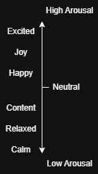

The defined scale of emotions stems from the Arousal-Valence models, with specific focus on the arousal due to the nature of our product. 

Each adjective acts as a contruct for which the questionnaire is focused on. The constructs are restricted to positive adjective to avoid asking the user questions such as "How depressed are you feeling?", as this may have adverse effects on the users current mood.

The questionnaire is designed to be minimal in length, so each construct is only measured by one question. Each has the same structure:

> On a scale from not at all to completely, how [insert contruct] are you feeling?

The user's input is defined by a quantised dial value, which uses 7 discrete levels on a likert scale.